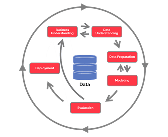

# Portfolio
---
## Assignments 1 Data Analytics in Zenius

### USE CASE DATA SCIENCE DI BISNIS INDUSTRI RETAIL

**CUSTOMER CHURN PREDICTION PADA E-COMMERCE** Chrun customer prediction bertujuan untuk memprediksi peluang pelanggan untuk beralih atau churn, sehingga e-commerce dapat memberikan perhatian yang meminimalkan peluang mereka untuk beralih. Prediksi dibuat menggunakan machine learning, dengan menggunakan salah satu algoritmanya yaitu regresi logistik, dimana algoritma regresi logistik akan mengklasifikasikan pelanggan sebagai chrun di masa mendatang atau tidak, dengan menerapkan metodologi Cross Industry Standard Process for Data Mining (CRISP-DM).

---

© 2020 Khanh Tran. Powered by Jekyll and the Minimal Theme.

